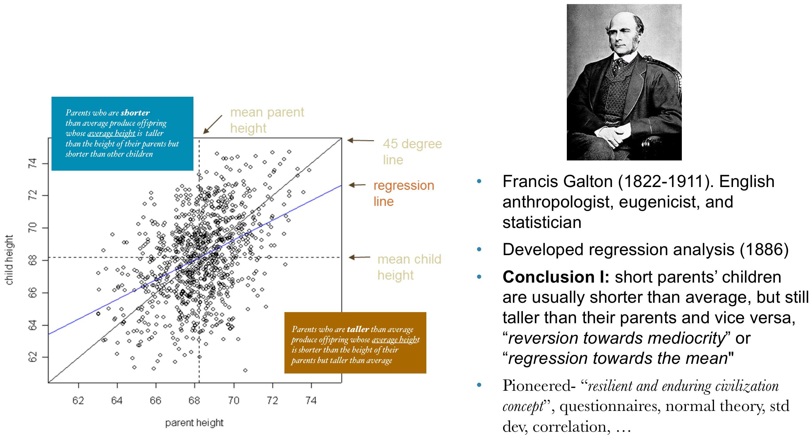
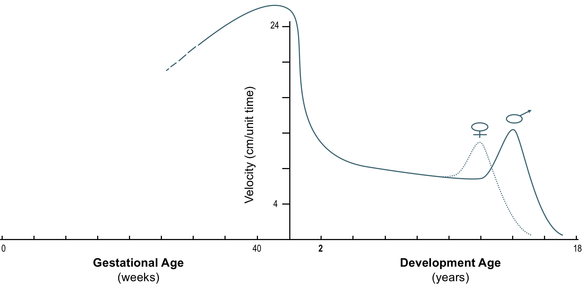
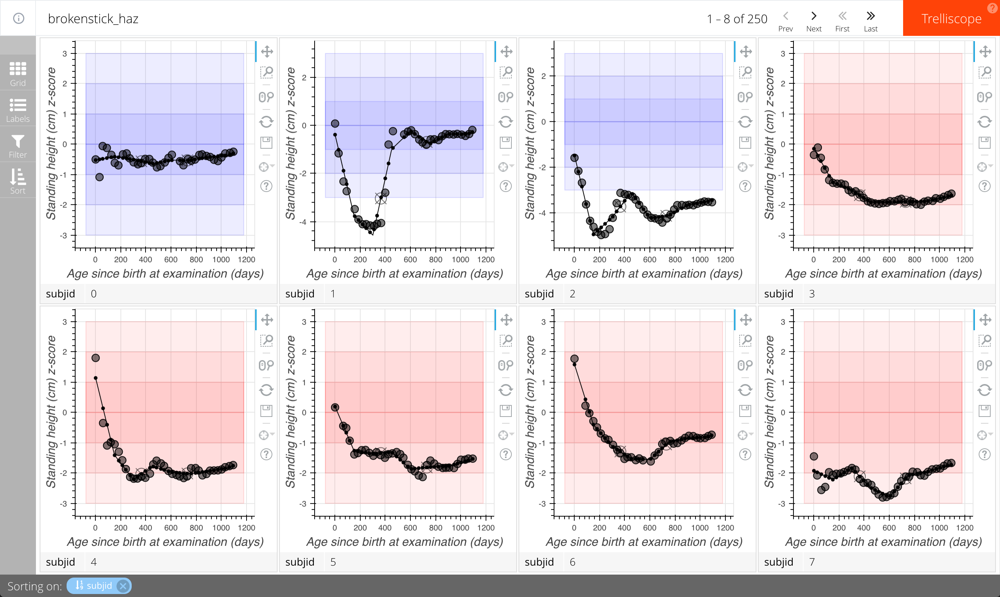

NOTE: To follow this document online (and to see interactive visualizations live), please visit https://hbgdki.github.io/gc-india-training/index.html.

# Overview

In this training we will cover methods for exploration, modeling, and visualization of data from a child growth study using tools and methods developed under the HBGDki program. We will cover the following topics:

- Reading in and merging multiple data files containing associated with a study and ensuring it is ready for analysis.
- Calculating Z-scores of anthropometric variables based on the WHO and INTERGROWTH standards.
- Checking the distributions of variables in the data and making some simple exploratory plots to get a better understanding of the study.
- Applying various anthropometric growth modeling and diagnostic methods.
- Visualizing and exploring anthropometric data with fitted growth curves

## R Environment

All of the exercises will be carried out using the R statistical programming environment making use of several modeling and visualization R packages, as well as the hbgd (http://hbgdki.github.io/hbgd/) R package which has been developed to make many of the aspects of working with growth data easier to do.

If you do not have much familiarity with R, you will still be able to comfortably run the examples in this training and follow along with the logic of what we are doing. If you wish to get more experience with R in general, we recommend a free resource, "Swirl" (http://swirlstats.com/) to get acquainted with the basics of R.

Participants will access this training through a virtual machine running in the cloud, with all code and R packages pre-installed and ready to run. Some of the plots will want to open up new windows. Please set up your web browser to allow pop ups by setting your popup blocker to OFF.

## Running on Your Own

For those wishing to continue their learning after this event, all code and data for these exercises can be found publicly online at https://github.com/hbgdki/gc-india-training and the README file on that page will contain instructions for getting this environment set up in your own environment and will provide links to other useful resources as well. We will also provide executable code and data on a thumb drive for your use.

## Data

In this training, we will work with synthetic data from a hypothetical study. This data was created from a model built from HBGD knowledgebase assets and any similarity to any one study is purely accidental. We have 3 csv files that might mirror how data is collected and maintained throughout the course of a study.

### enrollment.csv

This file contains the information collated for each subject at enrollment for the study.

Here are the first few observations held in this file:

```
SUBJID,APGAR5,GAGEBRTH,MEDUCYRS,BIRTHWT,BIRTHLEN,DELIVERY,SES,GRAVIDA,NLCHILD,DLVLOC,COMPRISK,EDUCCRGV,SEX
0,NA,270.0,10,2800,48.0,Normal Vaginal,Middle,1,0,Hospital,NA,10,M
1,10.0,283.0,3,3725,51.9,Normal Vaginal,Middle,1,0,Hospital,NA,3,M
2,NA,272.0,0,2680,46.8,Normal Vaginal,Low,1,0,Hospital,NA,0,M
3,NA,288.0,0,2540,47.05,Normal Vaginal,Low,3,2,Hospital,NA,0,F
4,NA,285.0,10,2700,NA,Normal Vaginal,Low,1,0,Hospital,NA,10,F
...
```

The first row of data is the header and each column is separated by a comma. Note that we have a subject ID and for each subject, we have several measurements. The meaning of some of these variables is evident from the column names but we see more about understanding the meaning of the variable names later.

### anthro.csv

This file contains longitudinal anthropometric variables measured over the first 3 years of each subject's life. The first few records in this data file:

```
SUBJID,AGEDAYS,BMI,HTCM,WTKG
0,1,12.15,49.11,2.94
0,32,14.19,52.82,3.77
0,57,12.48,57.88,4.55
0,90,15.05,61.06,5.41
...
```

Here we see measurements for subject with ID=0 at ages 1, 32, 57, and 90 days.

### post.csv

This file contains additional information tabulated about each child at the end of the study, having to do with diarrheal episodes.

```
SUBJID,SUMEP,SUMDIAR,SUMDAYS,PCTDIAR
0,5.0,29.0,1094,2.6508226691
1,21.0,81.0,1057,7.6631977294
2,4.0,5.0,1092,0.4578754579
3,7.0,18.0,1092,1.6483516484
4,3.0,10.0,1049,0.9532888465
...
```

We want to read in and merge all of this data into a form that we can analyze. This will be the first step in our exercises below.

# Exercises

The remainder of this document contains suggestions of hands-on examples of working with this data as outlined above.

## Getting Set Up

To begin, we need to load the R packages into our R environment that we will be using to analyze the data. The major packages we will use throughout are the hbgd (http://hbgdki.github.io/hbgd/) package and packages in the "Tidyverse". This collection of packages provides many powerful methods for many general-purpose data manipulation and visualization tasks. A free, excellent in-depth resource on packages in the Tidyverse can be found at http://r4ds.had.co.nz/.

```{r message=FALSE}
library(hbgd)
library(tidyverse)
library(trelliscopejs)
library(plotly)
```

## Reading in the Data

We described our three data files above, `enrollment.csv`, `anthro.csv`, and `post.csv`. These are all located in a subdirectory, `data/`.

We can read these three files into R as R data frames using the `read_csv()` function available in the Tidyverse "readr" R package. After reading them in, we will take a look at the `enroll` data frame.

```{r, message=FALSE}
enroll <- read_csv("data/enrollment.csv")
anthro <- read_csv("data/anthro.csv")
post <- read_csv("data/post.csv")

enroll
```

We see that there are 250 subjects in our study, and we can look at the values recorded at enrollment for these subjects.

***
**Your Turn:**  Which subject has the highest weight? Lowest gestational age? Longest length at birth? Also, view the data for the other data frames that we read in... How many anthro records are there? How many "post" records are there?

```{r message=FALSE}
message('Your code goes here')
```

***


## Joining the Data

We want to merge these three data frames into a single dataset that we can use for analysis.

First, let's merge the enrollment data and the anthro data. As we saw above, the enrollment data has one row per subject, while the anthro data has multiple records per subject. To merge the two, we want to match on subject IDs and preserve all the data. We can do this with a "full join" of the two datasets, which preserves all rows from both data sets based on a common variable or set of variables, repeating any rows as necessary.

In the Tidyverse package "dplyr", we can use the `full_join()` function in dplyr to achieve a full join. This function will detect any columns the two datasets have in common and use them as the joining variables (here, the common variable is `subjid`, which is what we want to merge on).

```{r}
anthro_enroll <- full_join(anthro, enroll)

anthro_enroll
```

It looks like we have successfully joined the data.

We can join in the "post" dataset in a similar fashion. We will call the output of all three merged files `dat`, and this will be the dataset we use for our analyses.

```{r}
dat <- full_join(anthro_enroll, post)

dat
```

## Checking the Data

Throughout, we will be using the "hbgd" R package to help with our analysis. To help us stay organized across analyses, the "hbgd" package enforces some data checks. One enforcement is that there are certain variables that must be present (`subjid`, for example). The package has a registry of variable names that have particular meaning and these are checked for to ensure clean code and organization across different datasets.

### Using check_data()

We can check to see if our data conforms to the standards of the "hbgd" package with the following:

```{r, collapse=TRUE}
check_data(dat)
```

We see some checks that did not pass. First, it told us that "All variable names are expected to be lowercase." and gave us a suggestion to fix it. It also told us that an expected variable is missing, `agedays` in the data, but that there is a variable with a name that is close, 'AGEDAY'. It also checks for other variables that are not required, but that it would expect to see in anthropometric data. Two of these, `haz` (Height-for-Age z-score), and `waz`(Weight for Age z-score), are variables we will add in later on.

To fix the major problems with the data, we want to make the variable names lowercase and rename `ageday` to `agedays`, which we can do with dplyr's `rename()` function. Then we can re-run `check_data()` to make sure we fixed everything.

```{r collapse=TRUE}
names(dat) <- tolower(names(dat))
dat <- rename(dat, agedays = ageday)

check_data(dat)
```

It looks like we are in good shape.

### Looking at Labels

One of the advantages of enforcing a common naming scheme for variables in the hbgd package is that we can store a database of variable labels for commonly-used variables. For example, if we want to know the meaning of all of the variables in our dataset, we can access them through a lookup table provided by the hbgd package, `hbgd_labels`:

```{r}
hbgd_labels[names(dat)]
```

### A Quick Plot

Let's make our first plot of the data. Here we will plot height vs. age for each subject and overlay a smooth mean curve.

We will use the "ggplot2" package, which is one of the most popular add-on packages for R, providing a powerful, flexible and well-thought-out platform to create data visualizations you can customize to your heart's content. A good reference for learning ggplot2 can be found at http://r4ds.had.co.nz/data-visualisation.html.

In addition to using ggplot2, we also use the "plotly" package, which will translate our ggplot2 plot into an interactive plot.

```{r}
p <- ggplot(dat, aes(x = agedays, y = htcm)) +
  geom_line(aes(group = subjid), alpha = 0.5) +
  geom_smooth(aes(group = 1), colour = "red", size = 1,
    method = "gam", formula = y ~ s(x))

ggplotly(p)
```

We see from this plot that the growth curves all vary around the smooth mean curve, and that there are some outliers above and below. Using your mouse to hover over these lines, you can see the subject IDs for these children and possibly further investigate.

## Growth standards

### HAZ and WAZ from WHO

We saw in our data check that it was hoping to see `haz` and `waz` (height-for-age z-score and weight-for-age z-score) variables in the data. These can be derived from the `htcm` and `wtkg` variables using the subject's `agedays` and the WHO growth standard, which is built in to the hbgd package. The data checking function also provided us with the code we need to perform this transformation:

```{r}
dat$haz <- who_htcm2zscore(dat$agedays, dat$htcm, dat$sex)
dat$waz <- who_wtkg2zscore(dat$agedays, dat$wtkg, dat$sex)
```

A full set of WHO conversion functions can be seen at http://hbgdki.github.io/hbgd/rd.html#specific_value_to_centilez_score or by typing `?who_htcm2zscore` in your R console.

Now that we have made this conversion, let's look at the growth curves on the z-score scale. Here, we use the same code as in our previous plot, but replace `htcm` with `haz`.

```{r}
p <- ggplot(dat, aes(x = agedays, y = haz)) +
  geom_line(aes(group = subjid), alpha = 0.5) +
  geom_smooth(aes(group = 1), colour = "red", size = 1,
    method = "gam", formula = y ~ s(x))

ggplotly(p)
```

Looking at the data on the z-score scale helps us notice trajectories that stand out from what is expected. For example we see several trajectories that appear to dip down low early on and recover. In the next section we will discuss a some methods for more targeted exploration of these trajectories.

## Exploring Trajectories

We can further explore growth trajectories that have interesting patterns by computing metrics for each child's trajectory and then use these metrics to filter down to trajectories of interest.

### Grouping the data by subject

There are some useful methods in the hbgd package for computing meaningful metrics about growth trajectories. To compute these metrics, we want to reduce our data to one row per subject, using a function `by_subject()`.

```{r}
subjdat <- by_subject(dat)

subjdat %>% select(subjid, longi) # just look at two columns
```

We see that the result of calling `by_subject()` on our data returns a data frame with 250 rows -- one row per subject. But what happened to our longitudinal data? If you look closely at the output dataset `subdat`, you will see that there is a new column, `longi`, which is a data frame of the longitudinal data for the subject. This column is not a scalar data type like we are used to seeing in cells of a data frame, but is a "list column". This is a useful way to store arbitrary data in a data frame format, and you can read more about this at http://r4ds.had.co.nz/many-models.html.

If you are curious to inspect what is contained in the `longi` column, we can inspect it for the first subject:

```{r}
subjdat[1,]$longi
```

The `longi` column is simply a data frame of the time-varying variables for the the subject.

### Plot the trajectory for the first subject

There is a built-in plot method for plotting individual trajectories. For example, to plot the fitted trajectory for the subject with subject ID = 1:

```{r fig.width=6, fig.height=6}
plot(subjdat, subjid = 1)
```

This plots the trajectory of `htcm` by default. We can plot the `haz` by specifying `y_var = "haz"`.

```{r fig.width=6, fig.height=6}
plot(subjdat, subjid = 1, y_var = "haz")
```

This subject has a rapid drop to a nadir of around `haz = -4` at around 1 year of age and then a recovery to a good height range.

More options for this plot function can be found by typing `?plot.subjDiv` in your R console.

***
**Your Turn:**  Does this subject's weight trajectory show any signs of a corresponding pattern? Hint: use the `plot()` with variables "wtkg", and "waz".

```{r message=FALSE}
message('Your code goes here')
```

***

### Computing trajectory metrics, or "cognostics"

We can choose which trajectories to visualize in a more meaningful way by adding some metrics, which we call "cognostics" to the data. The term "cognostics" refers to metrics about each child that can be useful to in guiding us to subgroups of interest. Using the hbgd package, this can be done with a function `add_longi_cogs()`.

```{r}
subjdat <- add_longi_cogs(subjdat)

subjdat %>% select(subjid, longi) # just look at two columns
```

We see that there are several new variables in our dataset that are metrics computed from the longitudinal data for each child. These metrics are:

- `min_haz`: minimum observed HAZ
- `min_haz_age`: age at which minimum observed HAZ occurred
- `max_haz`: maximum observed HAZ
- `max_haz_age`: age at which maximum observed HAZ occurred
- `min_waz`: minimum observed WAZ
- `min_waz_age`: age at which minimum observed WAZ occurred
- `max_waz`: maximum observed WAZ
- `max_waz_age`: age at which maximum observed WAZ occurred
- `haz_1day`: HAZ at 1 day (if measurement exists within 30 days of age 1 day)
- `haz_6months`:  HAZ at 6 months (if measurement exists within 30 days of age of 6 months)
- `haz_12months`: HAZ at 12 months (if measurement exists within 30 days of age of 12 months)
- `haz_24months`: HAZ at 24 months (if measurement exists within 30 days of age of 24 months)

We can use these metrics to narrow down our inspection of trajectories.

### Looking at trajectories based on cognostics

We noticed earlier that there are some trajectories that drop down below HAZ = -4 early on. To single these trajectories out, we can filter based on the new metrics that we have computed. Here, we look at subjects that went below -4 in the first 150 days of life:

```{r}
low_early <- filter(subjdat, min_haz < -4 & min_haz_age < 150)

low_early
```

We see that there are 5 subjects. If we want to make a similar plot as before with just these subjects, we first need to unnest the data in the `longi` column using a Tidyverse function, `unnest()`.

```{r}
low_early <- unnest(low_early)

low_early
```

We see that this data now is a regular data frame, with the longitudinal data having been expanded. Now we can plot it:

```{r}
ggplot(low_early, aes(x = agedays, y = haz)) +
  geom_line(aes(group = subjid), alpha = 0.5)
```

Now we can see clearly the phenomenon of these subjects having a significant recovery after dropping in length halfway into their first year.

***
**Your Turn:**  We noticed a few outlying trajectories jumping up higher than the rest in HAZ early on in life and then dropping back down. Can you make a plot in a similar fashion as we just did for low trajectories? Hint: look for subjects who have a `max_haz` that is larger than some high value (look at the plot of all trajectories above to get an idea of how high). You may also want to additionally filter on `max_haz_age`.

```{r message=FALSE}
message('Your code goes here')
```

***

### Interacting with trajectories using Trelliscope

Rather than manually creating trajectory plots for each subject or group of subjects, it is useful to be able to potentially look at any growth trajectory on-demand, and to interactively call trajectories to attention based on different search criteria.

We can accomplish this using the "trelliscopejs" package. Trelliscope is a visualization technique that allows you to create a database of a potentially very large number of plots which you can sort and filter in an interactive viewer. The variables against which you sort and filter are the "cognostics" that we've discussed before.

To create a Trelliscope plot, we first add a trajectory plot to each row of our data. This may take 10-20 seconds.

```{r message=FALSE}
subjdat <- add_trajectory_plot(subjdat, y_var = "haz")

subjdat %>% select(subjid, longi, panel) # just look at three columns
```

We see that `subjdat` now has a column called `panel`. This column, like `longi`, is a "list column", where each cell contains a trajectory plot.

We can now create a Trelliscope display using the `trelliscope()` function. It takes our `subdat` data frame as input, expecting to find a column that contains plots, and will create our database of plots and display them for us in an interactive viewer in our web browser. We give the display a name and specify where we want the files to go, as well as specify the default layout of the panels.

```{r message=FALSE}
trelliscope(subjdat, name = "haz", path = "displays", nrow = 2, ncol = 4)
```

This should open up an interactive viewer in your web browser.

There are 250 children in the dataset. 250 panels is too many to display at once, which is why the display is showing the first 8, by default ordered by subject ID.

Here are some simple interactions you can do with the Trelliscope display:

- Use the **"Prev"** and **"Next"** buttons, or your left and right arrow keys, to page through the panels of the display. This simple quick navigation helps you scan and find patterns that stick out.
- Click the **"Grid"** button on the sidebar and change the number of rows and columns that are being displayed per page.
- Click the **"Sort"** button on the sidebar to change the variables to order the panels according to.
  - You can click the **"x"** icon next to the existing sort variable ("subjid") to remove the sorting on that variable, and then choose a new variable from the list to sort on. The blue icon next the variable name allows you to toggle the order from increasing to decreasing.
- Click the "Filter" button on the sidebar to filter the panels to be displayed. A list of cognostic variables is shown and you can select one to filter on. For example, if you select `birthwt`, an interactive histogram showing the distribution of this variable appears and you can click and drag on the distribution to select panels for children that, for example, have low birth weight.
- Click the "Labels" button on the sidebar to control which labels are displayed underneath each panel.


***
**Your Turn:**  Can you explore this display to find some interesting insights? Do trajectories look different for children of higher socioeconomic status (use filtering on the `ses` variable). Can you recreate the group using the filters that we were looking at before (with `min_haz < -4` and `min_haz_age < 150`)? Are the distributions of other cognostics different for this group of children?
***


## Exploratory Plots

The hbgd package has several functions that allow you to get a quick overview of some of the attributes of your dataset.

### Missing Values

The `plot_missing()` function will give you a plot showing each variable and how many times it is NA vs. non-NA. It distinguishes between subject-level variables and time-varying variables, which can be toggled with the option `subject = TRUE/FALSE`.

```{r}
plot_missing(dat, subject = TRUE)
```

Other than `apgar5` and `comprisk`, our variables are fairly complete. You can hover the bars in the barchart to see the number of missing observations.

```{r}
plot_missing(dat, subject = FALSE)
```

There are no missing anthropometry variables.

### Univariate Summaries

With R, it is simple to create univariate summaries such as histograms and barcharts, but the hbgd package has a simple function that will create univariate distribution plots of all of your variables and add the appropriate labels for the variable names. This function, `plot_univar()`, operates like `plot_missing()` in that it has a `subject = TRUE/FALSE` flag to plot distributions for subject-level or time-varying variables. This separation is necessary because for subject-level variables, we only want to count things once.

```{r}
plot_univar(dat, subject = TRUE)
```

Here we get a grid of distribution plots, bar charts for categorical variables and histograms for numeric variables. Glancing these distributions can be useful to look for obvious outliers, look for unexpected shapes in distributions, and ensure that the units the variables are being reported in make sense.

```{r}
plot_univar(dat, subject = FALSE)
```

Everything looks good.

### Records Per Subject

To get a feel for how densely measured the children in the study are, we can use the `plot_visit_distn()` to get a histogram and quantile plot of the number of records per subject:

```{r}
plot_visit_distn(dat, width = 350, height = 350)
```

The median number of times a child is observed in this data is 38 times, roughly once per month over 3 years.

### First Observed Record Per Subject

We can use `plot_first_visit_age()` to get a histogram and quantile plot of age (in days) of the first observed record for each subject:

```{r}
plot_first_visit_age(dat, width = 350, height = 350)
```

All children were observed on day 1.

### Number of Records by Age

It is useful to look at the number of records in the data by child's age to see if there is a pattern to the tracking design of the study. We can use the `get_agefreq()` function to calculate the frequency of measurements for each age, and then `plot_agefreq()` to plot the result.

```{r}
agefreq <- get_agefreq(dat)
plot_agefreq(agefreq)
```

The ages at which measurements are taken have a monthly periodicity.


## Flash Introduction to Regression



### Basic Linear Models

If there is a variable $x$ that is believed to hold a linear relationship with another variable y, the goal is the find the best fitting line to the data and a linear model may be useful. The model will take the form

$$y_i = \alpha x_i + \beta + e_i$$

Most of us find it easier to think of the model without the $e_i$, which is just residual of data point $i$ (some may call this the 'error'). The most commonly used method to fit linear models is called the 'least squares regression line' and it has some special properties:
   - it minimizes the sum of the squared residuals,
   - the sum of the residuals is zero, and
   - the point (mean(x), mean(y)) falls on the line.

Here is a simple example loading data `x` and `y` from "data/reg.Rdata" and fitting a linear model of y vs. x.

```{r}
load("data/reg.Rdata")
fit <- lm(y ~ x)   # y 'as a linear function of' x
```

We can plot the data and fitted line with the following:

```{r}
plot(x, y)         # look at the scatter plot
abline(fit)        # add the least squares line onto the scatter plot
```

The output is saved in `fit` and may be viewed by typing in `fit` and hitting enter or by looking at `summary(fit)`

Quiz: What is the solution to our regression line "y=mx+c"?

```{r}
fit
```

The number corresponding to the y-intercept is the number below (Intercept). The second value that falls below x corresponds to the coefficient of x (the slope in the equation).

To put this into the form of an equation $y = \alpha x + \beta$:

$$y = 1.659*x + 15.610$$

To get more information from fit, the summary is useful:

```{r}
summary(fit)
```

Notice that the two values from the output of fit fall under the column "Estimate". The $R^2$ of the fit is found by looking at "Multiple R-Squared" (in this case, it is 0.6024).

### Finding Predictors and Residuals

Continuing on with the example above, it's time to put the model fit to use. Given the model, if we want to look at what the predicted value of one of our x's would be, say at 12, what do we do? To find this, we just use our least squares fit and plug 12 into the equation:

$$\hat{y} = 1.659*12 + 15.610 = 35.518$$

So when x=12, we expect y to be about 35.518. This could be computed in R rather than using a calculator. From our x variable- the position in x corresponding to the value 12 is the 22nd position, so in R:

```{r}
1.659*x[22] + 15.610
```

To check my answer in R, I could also use `fit`, which stores extra information including predicted values:

```{r}
fit$fitted[22]
```

Why are the answers slightly different?
If we are interested in the predicted value, odds are we also have interest in the residual at the given point. To compute the residual of a point, we use
     residual = observed - predicted
So, in the case for when x=12 with a predicted value of 35.52 (and an observed value of 38.54, which is shown by the red dot in the plot), the residual would be
      38.54 - 35.52 = 3.02
As with the predicted, R will save the residuals in fit, and the residuals may be extracted using

```{r}
fit$resid[22]
```

 If a residual is positive, then we know the observed value was larger than the predicted. If a residual is negative, then we know the observed value was smaller than the predicted. This follows directly from the equation
     residual = observed - predicted

Residuals help us determine how well our selected model fits the data. The goodness of fit can be evaluated visually via regression diagnostics. The plots below are the first two diagnostic plots available in R:

```{r}
plot(fit)
```

The first plot gives an idea of whether there is any curvature in the data. If the red line is strongly curved, a quadratic or other model may be better. In this case, the curvature is not strong (so a quadratic component in the model is not necessary). The second plot is to check whether the residuals are normally distributed. The third plot is used to check if the variance is constant (i.e., if the standard deviation among the residuals appears to be about constant). If the red line is strongly tilted up/down, that is a red flag. There are no issues with that in this example - the variance appears constant. (The red line will always move up/down a little because of inherent randomness.) The last plot is used to check to see if there were any overly influential points.

### Confidence Intervals

Given a linear model, a confidence interval may be easily obtained by using the function confint(), and to change the level of confidence, you can add in the level argument:

```{r}
confint(fit)
confint(fit, level=0.9)
```

## Applying Growth Models

Moving back to our longitudinal anthropometric data, since the data is longitudinal and the growth pattern over time is nonlinear we will be exploring some mixed effects nonlinear growth models.

First we start by fitting a simple exponential growth model:

Length = Linf - (Linf - L0) * exp(-Kgr * AGE)

where

- Linf is the asymptote (maximum possible length)
- L0 is the length at time = 0
- Kgr is the rate of exponential growth.


```{r message=FALSE}
source("ModelFunctions.R")
require(nlme)
```

This run will take about 10 seconds.

```{r}
dat$agemonths <- days2months(dat$agedays)

fit1 <- nlme(htcm ~ MonoExpModel(lnLinf, lnL0, lnKgr, agemonths),
  random = list(subjid = lnLinf + lnL0 + lnKgr ~ 1),
  fixed = lnLinf + lnL0 + lnKgr ~ 1,
  start = c(lnLinf = log(130), lnL0 = log(50), lnKgr = log(0.01)),
  data = dat,
  na.action = na.omit)

fit1
```

The output from the model has several components. Let us extract the parameters the AIC and look at the residuals plot. Note that the parameters were log transformed in the fitting to keep them in the positive domain.

```{r}
fit1.params <- exp(fixed.effects(fit1))
print(fit1.params)
```


```{r}
AIC(fit1)
```

```{r}
plot(fit1)
```

The Linf is 97 cm and L0 is 51 cm both are reasonable. The growth rate is approximately 5% per month and is constant throughout the time the kid is followed. Can we assume that growth rate is constant?

The residuals plot show that we have a sigmoidal trend. Obviously there is an important feature of the growth that this model is not able to capture. We will get back to the AIC for model comparisons.

Before trying more elaborate models let us see how the data based rate of growth (velocity) versus the model based one compare.

The data based velocity is a simple timewise difference of length divided by the age difference

(Length obs2 - length obs1) / (age obs2 - age obs1)

The model based velocity can be computed using the derivative of the function

Length= Linf - (Linf - L0) * exp(-Kgr * AGE)

dldt  = Kgr * (Linf - L0) * exp(-Kgr * AGE)


```{r}
deltadplyr <- dat %>%
  select(subjid, agemonths, htcm) %>%
  group_by(subjid) %>%
  mutate(
    difflcm = htcm - lag(htcm), # htcm difference between the two consecutive observation
    diffage = agemonths - lag(agemonths), # age difference between the two consecutive observation
    dldt = difflcm / diffage,
    obsmean =  (htcm + lag(htcm)) / 2, # htcm difference mean
    tmean =  (agemonths + lag(agemonths)) / 2 ) # age difference mean
# the ratio is the velocity note that velocity is not defined
# for the first observation of each subject let us filter it out
deltadplyr <- deltadplyr %>%
  filter(!is.na(dldt))

pred.fit1 <- data.frame(agemonths = sort(unique(dat$agemonths)))
pred.fit1$pred <- predict(fit1, newdata = pred.fit1, level = 0)
pred.fit1$dldt <- with(as.list(fixef(fit1)),
  exp(lnKgr) * (exp(lnLinf) - exp(lnL0)) * exp(-exp(lnKgr) * pred.fit1$agemonths))

plot1 <- ggplot(data = deltadplyr, aes (x = obsmean, y = dldt) ) +
  geom_point(alpha = 0.1) +
  xlab ("Length (cm)" ) +
  ylab ( "Derivative of length (dL/dt)") +
  stat_smooth(method = "gam", formula = y ~ s(x), aes(col = "Data Based"), size = 1.5) +
  geom_line(data = pred.fit1, aes(x = pred, y = dldt, col = "Exp Model Based"), size = 1.5) +
  labs(colour = "") +
  scale_colour_manual(breaks = c("Data Based", "Exp Model Based"),
    values = c("darkgray", "red")) +
  theme_bw()
plot1
```

We notice that the "velocity" is changing and it is not simply proportional to the current length as we grow taller the velocity becomes slower let us try a model where the rate of growth decelerate with time.



Kgr   = Kgr0 * (1 - Kgrdec + Kgrdec * exp(-lambda * TIME))

Length= Linf - (Linf - L0) * exp(-Kgr * TIME)

The difference with the previous model is that the growth rate Kgr is decelerating over time it starts with a baseline Kgr0 and decelerates using a hyperbolic function.

```{r}
fit2 <- nlme(htcm ~ NLLDmodel(lnLinf, lnL0, lnKgr0, logitKgrdec, lnTTP50, agemonths),
  random = list(subjid = pdDiag(lnLinf + lnKgr0 + lnL0 ~ 1)),
  fixed = lnLinf + lnL0 + lnKgr0 + logitKgrdec + lnTTP50 ~ 1,
  start = c(lnLinf = log(121), lnL0 = log(44), lnKgr0 = log(0.05),
    logitKgrdec = 1.7, lnTTP50 = log(6)),
  data = dat, na.action = na.omit,
  control = nlmeControl(maxIter = 100, returnObject = TRUE), verbose = FALSE)

fit2.params <- fixed.effects(fit2)
print(c(exp(fit2.params[c(1, 2, 3, 5)]), expit(fit2.params[4])))
```


```{r}
AIC(fit2)
AIC(fit1)
```

Fit 2 has lower(better) AIC.

```{r}
plot(fit2)
```

```{r}
pred.fit2 <- data.frame(agemonths = sort(unique(dat$agemonths)))
pred.fit2$pred <- predict(fit2, newdata = pred.fit2, level = 0)
pred.fit2$lambda <- log(2) / exp(fixef(fit2)["lnTTP50"])
pred.fit2$Kgrdec <- expit(fixef(fit2)["logitKgrdec"])
pred.fit2$kgr <- with(as.list(fixef(fit2)),
  exp(lnKgr0) * (1 - pred.fit2$Kgrdec + pred.fit2$Kgrdec *
    exp(-pred.fit2$lambda * pred.fit2$agemonths)))

pred.fit2$dldt <- with(as.list(c(fixef(fit2), pred.fit2)),
  (exp(lnLinf) - exp(lnL0)) * exp(-kgr * agemonths) *
    (kgr - agemonths * lambda * exp(lnKgr0) * Kgrdec * exp(-lambda * agemonths)))

plot2 <-
  ggplot(deltadplyr, aes(obsmean, dldt)) +
  geom_point(alpha = 0.05) +
  stat_smooth(method = "gam", formula = y~s(x), aes(col = "Data Based"), size = 1.2) +
  geom_line(data = pred.fit1, aes(x = pred, y = dldt, col = "Exp Model"), size = 1.2) +
  geom_line(data = pred.fit2, aes(x = pred, y = dldt, col = "Nonlinear Deceleration Model"), size = 1.2) +
  xlab("Length (cm)") +
  ylab("Derivative of length (dL/dt)") +
  scale_colour_manual(breaks = c("Data Based", "Exp Model", "Nonlinear Deceleration Model"),
    values = c("darkgray", "red", "blue")) +
  theme_bw() +
  theme(legend.title = element_blank(), legend.position = "top",
    axis.text = element_text(size = 12),
    axis.title = element_text(size = 12, face = "bold")) +
  theme(panel.grid.minor  =  element_line(colour = "gray", linetype = "dotted")) +
  theme(panel.grid.major =  element_line(colour = "gray", linetype = "solid")) +
  coord_cartesian(ylim = c(-5, 10))

plot2
```

```{r}
anova(fit1, fit2, test = "F")
```

The nonlinear deceleration model has lower AIC better residual patterns and better matches the data based velocity.

What about potential covariates that let us explain some of the heterogeneity ?
Let us extract the random effects of the fit and see if they correlate with some of the covariates we have.

```{r warning=FALSE, message=FALSE}
fit2RE <- ranef(fit2, augFrame = TRUE, data = dat)
fit2RE$MODEL <- "NLD - No Covariates"
fit2RE <- gather(fit2RE, randomeffects,value, lnLinf,lnKgr0  ,lnL0 )

# look at the boxplot by sex and panel by SES socioeconomic status
ggplot(fit2RE, aes(sex, value)) +
  geom_boxplot(varwidth = TRUE)+
  geom_smooth(aes(group = 1), se = FALSE)+
  facet_grid(randomeffects ~ ses, scales = "free_y")+
  theme_bw()
```

We see some trend related to sex.

In the supplemental material section, we will show how to include sex in the model.

## Applying Growth Models Using the hbgd Package

While it is useful to fit models to data in a completely free-form and ad-hoc manner as in the previous examples, the hbgd R package provides a uniform interface to a library of anthropometric growth modeling functions as well as diagnostic and visualization methods for the results of these models, as well as automatic computations of z-score transformations and derivatives. This can make it much easier to access modeling methods from a curated library of possible choices.

To see what methods are currently available in the hbgd package:

```{r}
get_avail_methods()
```

In this section we will show an example of fitting using the "brokenstick" method.

### Apply the Brokenstick Model to the data

The brokenstick method describes a set of individual curves by a linear mixed model using first order linear B-splines.

To apply a fit method to data, we use the `get_fit()` function. We provide this function with our data, a specification of which method to use, the variables to use in fitting (`x_var` is expected to be `agedays` and `y_var` can be any anthropometric measure or its z-score transformation), and optionally any parameters to pass on to the fitting method being used.

Here, we apply the brokenstick method to HAZ and specify the location of the knots (a brokenstick-specific fitting parameter). Please be patient! This method takes about a minute to run.

```{r cache=TRUE, warning=FALSE}
datfit <- get_fit(dat, method = "brokenstick", y_var = "haz",
  knots = seq(1, 1100, by = 150))

datfit
```

The resulting object is a fit object from the fitting method along with other information about the fit.

We can apply this fitting result to all of our subjects using `fit_all_trajectories()`.

```{r}
allfits <- fit_all_trajectories(dat, datfit)

allfits
```

As we saw earlier with `by_subject()`, this result is a data frame with one row per subject. Each row contains subject-level data and a "list column"" `longi` with a data frame of the longitudinal data for the subject and another "list column"" called `fit` which contains information about the fit for the subject, including the fitted values, the curve imputed over a grid of points (including the z-score transformed version of the variable as well as numeric derivatives), and the raw data for the subject.

### Plot the fitted trajectory for the first subject

There is a built-in plot method for plotting individual trajectories. For example, to plot the fitted trajectory for the second subject:

```{r fig.width=6, fig.height=6}
plot(allfits$fit[[2]])
```

This plots the subject's growth trajectory on the raw scale, superposed over the WHO growth standard (each band represents one standard deviation), and a superposed fitted line from our model.

This child was tracking well below stunted for the first year of life and then recovered to be tracking around the median thereafter.

It is often useful to look at the data and fitted trajectory on the z-score scale, which we can do with `plot_z()`.

```{r fig.width=6, fig.height=6}
plot_z(allfits$fit[[2]])
```

Viewing the trajectory at this scale helps us see what is happening more clearly. It also highlights the piecewise linear nature of the brokenstick method.

### Look at all fits on z-score scale using Trelliscope

Similar to what we saw in the exploratory section at the beginning of the tutorial, we can plot trajectories with their fitted models in Trelliscope.

```{r message=FALSE, eval=FALSE}
allfits %>%
  add_all_cogs() %>%
  add_trajectory_plot(z = TRUE) %>%
  trelliscope(name = "brokenstick_haz", path = "display_fits", nrow = 2, ncol = 4)
```

This should open up an interactive viewer in your web browser. When the display opens, you should see something like this:




# Bonus Material & Examples

## Data Utility Functions

There are other utility functions for dealing with data in the hbgd package. The typical kind of dataset we work with in the package is a single data frame of anthropometric measurements as well as subject-level variables (such as those recorded at enrollment). However, often we want to work with just the subject-level data and ignore the anthropometry. To get just the subject-level data, we can use the function `get_subject_data()`. Below we create a new data frame of just the subject-level data, `subj_dat`, and print it:

```{r eval=FALSE}
subj_dat <- get_subject_data(dat)
subj_dat
```

We can use this data to look at the subject-specific data for our lowest outlying child from our first exploratory plot, subject 139. Here we use the `filter()` function available in the Tidyverse "dplyr" package.

```{r eval=FALSE}
filter(subj_dat, subjid == 139)
```

## SGA from INTERGROWTH Birth Standard

The hbgd package has other growth standards available for use, including INTERGROWTH fetal and birth standards. Since this data has gestational age at birth and birthweight, we can use the INTERGROWTH birth standard to look at the distribution of children's birth weight percentiles and see how much of the population is small for gestational age (SGA).

Looking at the documentation for the INTERGROWTH conversion function at http://hbgdki.github.io/hbgd/rd.html#specific_value_to_centilez_score_1, we see that it requires us to provide birth weight in kilograms. From our labels above, we saw that the variable `birthwt` should be reported in grams, so we make the conversion.

Note that we want to apply this conversion to only
 our subject-level dataset since it has one record per subject, while `dat` has multiple rows per subject.

Here we compute the birth weight centile for each child, calculate the percentage of these children below the 10th centile, and plot a histogram of the result.

```{r eval=FALSE}
birthcentile <- igb_wtkg2centile(subj_dat$gagebrth,
  subj_dat$birthwt / 1000, sex = subj_dat$sex)

# 31.6% of children are small for gestational age
length(which(birthcentile < 10)) / length(birthcentile)

hist(birthcentile)
abline(v = 10)
```

## Adding covariates to the model

In the model fitting examples earlier, since we noticed some sex related difference, here we include it in the model. Please be patient! This will take about a minute to run.

```{r  eval=FALSE}
dat$sex <- as.factor(dat$sex)

fit3 <- update(fit2,
  fixed = list(lnLinf + lnL0 + lnKgr0 ~ sex, logitKgrdec + lnTTP50 ~ 1),
  start = c(lnLinf = c(log(100), 0),
    lnL0 = c(log(50), 0),
    lnKgr0 = c(log(0.01), 0),
    logitKgrdec = 0,
    lnTTP50 = log(4)
  ))

fit3RE <- ranef(fit3, augFrame = TRUE, data = dat)
fit3RE$MODEL <- "NLD - SEX Covariates"
names(fit3RE)[1:3] <- names(ranef(fit2, augFrame = TRUE, data = dat))[1:3]
fit3RE <- gather(fit3RE, randomeffects, value, lnLinf, lnKgr0, lnL0)
```

Look at the boxplot by sex and panel by SES socioeconomic status:

```{r eval=FALSE}
ggplot(fit3RE, aes(sex, value)) +
  geom_boxplot(varwidth = TRUE) +
  geom_smooth(aes(group = 1), se = FALSE) +
  facet_grid(randomeffects ~ SES, scales = "free_y") +
  theme_bw()
```

```{r eval=FALSE}
fit2and3RE <- rbind(fit2RE, fit3RE)

ggplot(fit2and3RE, aes(sex, value, col = MODEL)) +
  geom_boxplot() +
  geom_smooth(aes(group = MODEL, colour = MODEL), se = FALSE, size = 2) +
  facet_grid(randomeffects ~ MODEL, scales = "free_y") +
  theme_bw()
```

```{r eval=FALSE}
anova(fit2, fit3, test = "F")
```


