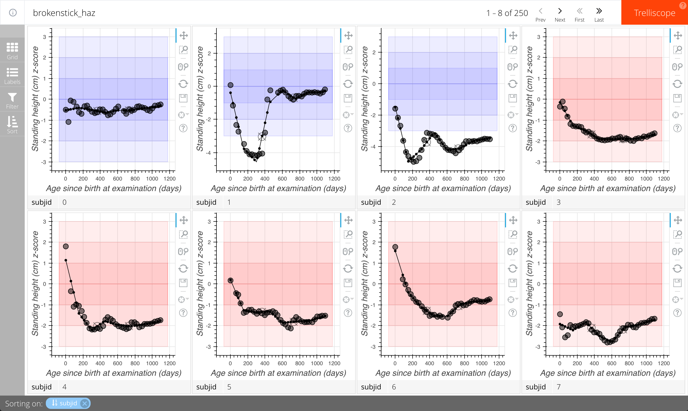

# Overview

In this training we will cover methods for exploration, modeling, and visualization of data from a child growth study using tools and methods developed under the HBGDki program. We will cover the following topics:

- Reading in and merging multiple data files containing associated with a study and ensuring it is ready for analysis.
- Calculating Z-scores of anthropometric variables based on the WHO and INTERGROWTH standards.
- Checking the distributions of variables in the data and making some simple exploratory plots to get a better understanding of the study.
- Applying various anthropometric growth modeling and diagnostic methods.
- Visualizing and exploring anthropometric data with fitted growth curves

## R Environment

All of the exercises will be carried out using the R statistical programming environment making use of several modeling and visualization R packages, as well as the [hbgd]() R package which has been developed to make many of the aspects of working growth data easier to do.

If you do not have much familiarity with R, you will still be able to comfortably run the examples in this training and follow along with the logic of what we are doing. If you wish to get more experience with R in general, we recommend a free resource, ["Swirl"](http://swirlstats.com/) to get acquainted with the basics of R.

## Running on Your Own

Participants will access this training through a virtual machine running in the cloud, with all code and R packages pre-installed and ready to run. For those wishing to continue their learning after this event, all code and data for these exercises can be found publicly online [here]() and the README file on that page will contain instructions for getting this environment set up in your own environment and will provide links to other useful resources as well.

## Data

In this training, we will work with synthetic data from a hypothetical study. We have 3 csv files that might mirror how data is collected and maintained throughout the course of a study.

#### enrollment.csv

This file contains the information collated for each subject at enrollment for the study.

Here are the first few observations held in this file:

```
SUBJID,APGAR5,GAGEBRTH,MEDUCYRS,BIRTHWT,BIRTHLEN,DELIVERY,SES,GRAVIDA,NLCHILD,DLVLOC,COMPRISK,EDUCCRGV,SEX
0,NA,270.0,10,2800,48.0,Normal Vaginal,Middle,1,0,Hospital,NA,10,M
1,10.0,283.0,3,3725,51.9,Normal Vaginal,Middle,1,0,Hospital,NA,3,M
2,NA,272.0,0,2680,46.8,Normal Vaginal,Low,1,0,Hospital,NA,0,M
3,NA,288.0,0,2540,47.05,Normal Vaginal,Low,3,2,Hospital,NA,0,F
4,NA,285.0,10,2700,NA,Normal Vaginal,Low,1,0,Hospital,NA,10,F
...
```

The first row of data is the header and each column is separated by a comma. Note that we have a subject ID and for each subject, we have several measurements. The meaning of some of these variables is evident from the column names but we see more about understanding the meaning of the variable names later.

#### anthro.csv

This file contains anthropometric variables measured over the first 3 years of each subject's life. The first few records in this data file:

```
SUBJID,AGEDAYS,BMI,HTCM,WTKG
0,1,12.15,49.11,2.94
0,32,14.19,52.82,3.77
0,57,12.48,57.88,4.55
0,90,15.05,61.06,5.41
...
```

Here we see measurements for subject with ID=0 at ages 1, 32, 57, and 90 days.

#### post.csv

This file contains additional information tabulated about each child at the end of the study, having to do with diarrheal episodes.

```
SUBJID,SUMEP,SUMDIAR,SUMDAYS,PCTDIAR
0,5.0,29.0,1094,2.6508226691
1,21.0,81.0,1057,7.6631977294
2,4.0,5.0,1092,0.4578754579
3,7.0,18.0,1092,1.6483516484
4,3.0,10.0,1049,0.9532888465
...
```

We want to read in and merge all of this data into a form that we can analyze. This will be the first step in our exercises below.

# Exercises

The remainder of this document contains hands-on examples of working with this data as outlined above.

## Getting Set Up

To begin, we need to load the R packages into our R environment that we will be using to analyze the data. The major packages we will use throughout are the [hbgd]() package and packages in the "Tidyverse". This collection of packages provides many powerful methods for many general-purpose data manipulation and visualization tasks. A free, excellent in-depth resources on package in the Tidyverse can be found [here]().

```{r message=FALSE}
library(hbgd)
library(tidyverse)
library(trelliscopejs)
```

## Reading in the Data

We described our three data files above, `enrollment.csv`, `anthro.csv`, and `post.csv`. These are all located in a subdirectory, `data/`.

We can read these three files into R as R data frames using the `read_csv()` function available in the Tidyverse "readr" R package. After reading them in, we will take a look at the `enroll` data frame.

```{r, message=FALSE}
enroll <- read_csv("data/enrollment.csv")
anthro <- read_csv("data/anthro.csv")
post <- read_csv("data/post.csv")

enroll
```

We see that there are 250 subjects in our study, and we can look at the values recorded at enrollment for these subjects.

(Possible early very simple exercise: View the data for the other data frames that we read in... How many anthro records are there? How many "post" records are there?)

## Joining the Data

We want to merge these three data frames into a single dataset that we can use for analysis.

First, let's merge the enrollment data and the anthro data. As we saw above, the enrollment data has one row per subject, while the anthro data has multiple records per subject. To merge the two, we want to match on subject IDs and preserve all the data. We can do this with a "full join" of the two datasets, which preserves all rows from both data sets based on a common variable or set of variables, repeating any rows as necessary.

In the Tidyverse package "dplyr", we can use the `full_join()` function in dplyr to achieve a full join. This function will detect any columns the two datasets have in common and use them as the joining vairables (here, the common variable is `subjid`, which is what we want to merge on).

```{r}
anthro_enroll <- full_join(anthro, enroll)

anthro_enroll
```

It looks like we have successfully joined the data.

We can join in the "post" dataset in a similar fashion. We will call the output of all three merged files `dat`, and this will be the dataset we use for our analyses.

```{r}
dat <- full_join(anthro_enroll, post)

dat
```

## Checking the Data

Throughout, we will be using the "hbgd" R package to help with our anlysis. To help us stay organized across analyses, the "hbgd" package enforces some data checks. One enforcement is that there are certain variables that must be present (`subjid`, for example). The package has a registry of variable names that have particular meaning and these are checked for to ensure clean code and organization across different datasets.

### Using check_data()

We can check to see if our data conforms to the standards of the "hbgd" package with the following:

```{r}
check_data(dat)
```

We see some checks that did not pass. First, it told us that "All variable names are expected to be lowercase." and gave us a suggestion to fix it. It also told us that there is not an expected variable, `agedays` in the data, but that there is a variable with a name that is close, 'AGEDAY'. It also checks for other variables that are not required, but that it would expect to see in anthropometric data. Two of these, `haz` and `waz`, are variables we will add in later on.

To fix the major problems with the data, we want to make the variable names lowercase and rename `ageday` to `agedays`, which we can do with dplyr's `rename()` function. Then we can re-run `check_data()` to make sure we fixed everything.

```{r}
names(dat) <- tolower(names(dat))
dat <- rename(dat, agedays = ageday)

check_data(dat)
```

It looks like we are in good shape.

### Looking at Labels

One of the advantages of enforcing a common naming scheme for variables in the hbgd package is that we can store a database of variable labels for commonly-used variables. For example, if we want to know the meaning of all of the variables in our dataset, we can access them through a lookup table provided by the hbgd package, `hbgd_labels`:

```{r}
hbgd_labels[names(dat)]
```

### A Quick Plot

Let's make our first plot of the data. Here we will plot height vs. age for each subject on the same plot and overlay a smooth mean curve. (TODO: high-level description of ggplot and the basics of what's happening here).

TODO: add `geom_who()` in here to compare trajectories to WHO standard

```{r}
ggplot(dat, aes(x = agedays, y = htcm)) +
  geom_line(aes(group = subjid), alpha = 0.5) +
  geom_smooth(aes(group = 1), colour = "red", size = 1,
    method = "gam", formula = y ~ s(x))
```

### Data Utility Functions

There are other utility functions for dealing with data in the hbgd package. The typical kind of dataset we work with in the package is a single data frame of anthropometric measurements as well as subject-level variables (such as those recorded at enrollment). However, often we want to work with just the subject-level data and ignore the anthropometry. To get just the subject-level data, we can use the function `get_subject_data()`. Below we create a new data frame of just the subject-level data, `subj_dat`, and print it:

```{r}
subj_dat <- get_subject_data(dat)
subj_dat
```

## Growth standards

### HAZ and WAZ from WHO

We saw in our data check that it was hoping to see `haz` and `waz` (height-for-age z-score and weight-for-age z-score) variables in the data. These can be derived from the `htcm` and `wtkg` variables using the subject's `agedays` and the WHO growth standard, which is built in to the hbgd package. The data checking function also provided us with the code we need to perform this transformation:

```{r}
dat$haz <- who_htcm2zscore(dat$agedays, dat$htcm, dat$sex)
dat$waz <- who_wtkg2zscore(dat$agedays, dat$wtkg, dat$sex)
```

A full set of WHO conversion functions can be seen [here](http://hbgdki.github.io/hbgd/rd.html#specific_value_to_centilez_score).

Now that we have made this conversion, let's look at the growth curves on the z-score scale:

```{r}
ggplot(dat, aes(x = agedays, y = haz)) +
  geom_line(aes(group = subjid), alpha = 0.5) +
  geom_smooth(aes(group = 1), colour = "red", size = 1,
    method = "gam", formula = y ~ s(x))
```

### SGA from INTERGROWTH

The hbgd package has other growth standards available for use, including INTERGROWTH fetal and birth standards. Since this data has gestational age at birth and birthweight, we can use the INTERGROWTH birth standard to look at the distribution of children's birth weight percentiles and see how much of the population is small for gestational age (SGA).

Looking at the documentation for the INTERGROWTH conversion function [here](http://hbgdki.github.io/hbgd/rd.html#specific_value_to_centilez_score_1), we see that it requires us to provide birth weight in kilograms. From our labels above, we saw that the variable `birthwt` should be reported in grams, so we make the conversion.

Note that we want to apply this conversion to only
 our subject-level dataset since it has one record per subject, while `dat` has multiple rows per subject.

Here we compute the birth weight centile for each child, calculate the percentage of these children below the 10th centile, and plot a histogram of the result.

```{r}
birthcentile <- igb_wtkg2centile(subj_dat$gagebrth,
  subj_dat$birthwt / 1000, sex = subj_dat$sex)

# 31.6% of children are small for gestational age
length(which(birthcentile < 10)) / length(birthcentile)

hist(birthcentile)
abline(v = 10)
```

## Exploratory Plots

The hbgd package has several functions that allow you to get a quick overview of some of the attributes of your dataset.

### Missing Values

The `plot_missing()` function will give you a plot showing each variable and how many times it is NA vs. non-NA. It distinguishes between subject-level variables and time-varying variables, which can be toggled with the option `subject = TRUE/FALSE`.

```{r}
plot_missing(dat, subject = TRUE)
```

Other than `apgar5` and `comprisk`, our variables are fairly complete. You can hover the bars in the barchart to see the number of missing observations.

```{r}
plot_missing(dat, subject = FALSE)
```

There are no missing anthropometry variables.

### Univariate Summaries

With R, it is simple to create univariate summaries such as histograms and barcharts, but the hbgd package has a simple function that will create univariate distribution plots of all of your variables and add the appropriate labels for the variable names. This function, `plot_univar()`, operates like `plot_missing()` in that it has a `subject = TRUE/FALSE` flag to plot distributions for subject-level or time-varying variables. This separation is necessary because for subject-level variables, we only want to count things once.

```{r}
plot_univar(dat, subject = TRUE)
```

Here we get a grid of distribution plots, bar charts for categorical variables and histograms for numeric variables. Glancing these distributions can be useful to look for obvious outliers, look for unexpected shapes in distributions, and ensure that the units the variables are being reported in make sense.

```{r}
plot_univar(dat, subject = FALSE)
```

Everything looks good.

### Records Per Subject

To get a feel for how densely measured the children in the study are, we can use the `plot_visit_distn()` to get a histogram and quantile plot of the number of records per subject:

```{r}
plot_visit_distn(dat, width = 350, height = 350)
```

The median number of times a child is observed in this data is 38 times, roughly once per month over 3 years.

## First Observed Record Per Subject

We can use `plot_first_visit_age()` to get a histogram and quantile plot of age (in days) of the first observed record for each subject:

```{r}
plot_first_visit_age(dat, width = 350, height = 350)
```

All children werre observed on day 1.

### Number of Records by Age

It is useful to look at the number of records in the data by child's age to see if there is a pattern to the tracking design of the study. We can use the `get_agefreq()` function to calculate the frequency of measurements for each age, and then `plot_agefreq()` to plot the result.

```{r}
agefreq <- get_agefreq(dat)
plot_agefreq(agefreq)
```

The ages at which measurements are taken have a monthly periodicity.

## Applying Growth Models

Since the data is longitudinal and the growth pattern over time is nonlinear we will be exploring some mixed effects nonlinear growth models.
First we start by fitting a simple exponential growth model:
Length= Linf - (Linf - L0) * exp(-Kgr * AGE)
where
Linf is the asymptote (maximum possible length)
L0 is the length at time = 0
Kgr is the rate of exponential growth

```{r}
source("ModelFunctions.r")
require(nlme)
d <- anthro_enroll
d$AGEMONTH <- days2months(d$AGEDAY)
ggplot(d,aes(AGEMONTH,HTCM,group=SUBJID))+
         geom_line()

fit1 <- nlme(HTCM ~ MonoExpModel(lnLinf, lnL0, lnKgr, AGEMONTH),
  random = list(SUBJID = lnLinf + lnL0 + lnKgr ~ 1),
  fixed = lnLinf + lnL0 + lnKgr ~ 1,
  start = c(lnLinf = log(130), lnL0 = log(50), lnKgr = log(0.01)),
  data = d,
  na.action = na.omit)
fit1
```
The output from the model has several components. Let us extract the parameters the AIC and look at the residuals plot. Note that the parameters were log transformed in the fitting to keep them in the positive domain.

```{r}

fit1.params <- exp(fixed.effects(fit1))
print(fit1.params)
AIC(fit1)
plot(fit1)

```
The Linf is 97 cm and L0 is 51 cm both are resonable. The growth rate is approximately 5 % per month and is constant throughout the time the kid is followed. Can we assume that growth rate is constant ?
The residuals plot show that we have a sigmoidal trend. Obviously there is an important feature of the growth that this model is not able to capture. We will get back to the AIC for model comparisons.

Before trying more elaborate models let us see how the data based rate of growth (velocity) versus the model based one compare.
The data based velocity is a simple timewise difference of length divided by the age difference
(Length obs2 - length obs1) / (age obs2 - age obs1)
The model based velocity can be computed using the derivative of the funciton
Length= Linf - (Linf - L0) * exp(-Kgr * AGE)
dldt  = Kgr * (Linf - L0) * exp(-Kgr * AGE)


```{r}
deltadplyr <- d %>%
  select(SUBJID, AGEMONTH, HTCM) %>%
  group_by(SUBJID) %>%
  mutate(
    difflcm = HTCM - lag(HTCM),# HTCM difference between the two consecutive observation
    diffage = AGEMONTH - lag(AGEMONTH), # age difference between the two consecutive observation
    dldt = difflcm / diffage,
    obsmean =  (HTCM + lag(HTCM))/2,# HTCM difference mean
    tmean =  (AGEMONTH + lag(AGEMONTH))/2 )# age difference mean
# the ratio is the velocity note that velocity is not defined for the first observation of each subject let us filter it out
deltadplyr <- deltadplyr%>%
filter(!is.na(dldt))

pred.fit1 <- data.frame(AGEMONTH = sort(unique(d$AGEMONTH)))
pred.fit1$pred <- predict(fit1, newdata = pred.fit1, level = 0)
pred.fit1$dldt <- with(as.list(fixef(fit1)),
  exp(lnKgr) * (exp(lnLinf) - exp(lnL0)) * exp(-exp(lnKgr) * pred.fit1$AGEMONTH))

plot1 <- ggplot( data = deltadplyr, aes (x = obsmean, y = dldt) ) +
  geom_point(alpha=0.1)+
  xlab ("Length (cm)" )+
  ylab ( "Derivative of length (dL/dt)") +
  stat_smooth(method = "gam", formula = y ~ s(x),aes(col="Data Based"),size=1.5) +
  geom_line(data = pred.fit1, aes(x = pred, y = dldt,col="Exp Model Based"),size=1.5)+
  labs(colour="")+
  scale_colour_manual(breaks = c("Data Based", "Exp Model Based"),
    values = c("darkgray", "red"))+
  theme_bw()
plot1
```

We notice that the "velocity" is changing and it is not simply proportional to the current length as we grow taller the velocity becomes slower let us try a modelr where the rate of growth decelerate with time.
Kgr   = Kgr0 * (1 - Kgrdec + Kgrdec * exp(-lambda * TIME))
Length= Linf - (Linf - L0) * exp(-Kgr * TIME)
The difference with the previous model is that the growth rate Kgr is decelerating over time it starts with a baseline Kgr0 and decelerates using a hyperbolic function


```{r}
fit2 <- nlme(HTCM ~ NLLDmodel(lnLinf, lnL0, lnKgr0, logitKgrdec, lnTTP50, AGEMONTH),
  random = list(SUBJID = pdDiag(lnLinf + lnKgr0 + lnL0 ~ 1)),
  fixed = lnLinf + lnL0 + lnKgr0 + logitKgrdec + lnTTP50 ~ 1,
  start = c(lnLinf = log(121), lnL0 = log(44), lnKgr0 = log(0.05),
    logitKgrdec = 1.7, lnTTP50 = log(6)),
  data = d, na.action = na.omit,
  control = nlmeControl(maxIter = 100, returnObject = TRUE), verbose = TRUE)

fit2.params <- fixed.effects(fit2)
print( c( exp( fit2.params[c(1,2,3,5)]  ), expit( fit2.params[4]  )   ) )

AIC(fit2) #  29219.9 fit 2 has lower(better) AIC
AIC(fit1) #  31793.38
plot(fit2)

pred.fit2 <- data.frame(AGEMONTH = sort(unique(d$AGEMONTH)))
pred.fit2$pred <- predict(fit2, newdata = pred.fit2, level = 0)
pred.fit2$lambda <- log(2) / exp(fixef(fit2)["lnTTP50"])
pred.fit2$Kgrdec <- expit(fixef(fit2)["logitKgrdec"])
pred.fit2$kgr <- with(as.list(fixef(fit2)),
  exp(lnKgr0) * (1 - pred.fit2$Kgrdec + pred.fit2$Kgrdec *
    exp(-pred.fit2$lambda * pred.fit2$AGEMONTH)))

pred.fit2$dldt <- with(as.list(c(fixef(fit2), pred.fit2)),
  (exp(lnLinf) - exp(lnL0)) * exp(-kgr * AGEMONTH) *
    (kgr - AGEMONTH * lambda * exp(lnKgr0) * Kgrdec * exp(-lambda * AGEMONTH)))

plot2 <-
  ggplot(deltas, aes(obsmean, dldt)) +
  geom_point(alpha = 0.05) +
  stat_smooth(method = "gam", formula = y~s(x), aes(col = "Data Based"), size = 1.2) +
  geom_line(data = pred.fit1, aes(x = pred, y = dldt, col = "Exp Model"), size = 1.2) +
  geom_line(data = pred.fit2, aes(x = pred, y = dldt, col = "Nonlinear Deceleration Model"), size = 1.2) +
  xlab("Length (cm)") +
  ylab("Derivative of length (dL/dt)") +
  scale_colour_manual(breaks = c("Data Based", "Exp Model", "Nonlinear Deceleration Model"),
    values = c("darkgray", "red", "blue")) +
  theme_bw() +
  theme(legend.title = element_blank(), legend.position = "top",
    axis.text = element_text(size = 12),
    axis.title = element_text(size = 12, face = "bold")) +
  theme(panel.grid.minor  =  element_line(colour = "gray", linetype = "dotted")) +
  theme(panel.grid.major =  element_line(colour = "gray", linetype = "solid")) +
  coord_cartesian(ylim = c(-5, 10))

plot2
anova(fit1, fit2, test = "F")
```
The nonlinear deceleration model has lower AIC better residual patterns and better matches the data based velocity.
What about potential covariates that let us explain some of the heterogeneity ?
Let us extract the random effects of the fit and see if they correlate with some of the covariates we have.

```{r}
fit2RE <- ranef(fit2, augFrame = TRUE, data = d)
fit2RE$MODEL <- "NLD - No Covariates"
fit2RE <- fit2RE %>%
gather(randomeffects,value, lnLinf,lnKgr0  ,lnL0 )

#look at the boxplot by sex and panel by SES socioeconomix status
ggplot(fit2RE, aes(SEX, value)) +
  geom_boxplot(varwidth = TRUE)+
  geom_smooth(aes(group=1),se=FALSE)+
  facet_grid(randomeffects~SES, scales="free_y")+
  theme_bw()

# we see some trend related to sex

```
Since we notice some sex related difference let us include it into the model


```{r}
d$SEX <- as.factor(d$SEX)

fit3 <- update(fit2,
  fixed = list(lnLinf + lnL0 + lnKgr0 ~ SEX, logitKgrdec + lnTTP50 ~ 1),
  start = c(lnLinf = c(log(100), 0),
    lnL0 = c(log(50), 0),
    lnKgr0 = c(log(0.01), 0),
    logitKgrdec = 0,
    lnTTP50 = log(4)
  ))

fit3RE <- ranef(fit3, augFrame = TRUE, data = d)
fit3RE$MODEL <- "NLD - SEX Covariates"
names(fit3RE)[1:3] <- names(ranef(fit2, augFrame = TRUE, data = d))[1:3]
fit3RE <- fit3RE %>%
gather(randomeffects,value, lnLinf,lnKgr0  ,lnL0 )

#look at the boxplot by sex and panel by SES socioeconomix status
ggplot(fit3RE, aes(SEX, value)) +
  geom_boxplot(varwidth = TRUE)+
  geom_smooth(aes(group=1),se=FALSE)+
  facet_grid(randomeffects~SES, scales="free_y")+
  theme_bw()


fit2and3RE<- rbind(fit2RE,fit3RE)

ggplot(fit2and3RE, aes(SEX, value,col=MODEL)) +
  geom_boxplot()+
  geom_smooth(aes(group=MODEL,colour=MODEL),se=FALSE,size=2)+
  facet_grid(randomeffects~MODEL, scales="free_y")+
  theme_bw()

anova(fit2, fit3, test = "F")

```


## Applying Growth Models Using the hbgd Package

While it is useful to fit models to data in a completely free-form and ad-hoc manner as in the previous examples, the hbgd R package provides a uniform interface to a library of anthropometric growth modeling functions as well as diagnostic and visualization methods for the results of these models, as well as automatic computations of z-score transformations and derivatives. This can make it much easier to access modeling methods from a curated library of possible choices.

To see what methods are currently available in the hbgd package:

```{r}
get_avail_methods()
```

In this section we will show an example of fitting using the "brokenstick" method.

### Apply the Brokenstick Model to the data

The brokenstick method...

To apply a fit method to data, we use the `get_fit()` function. We provide this function with our data, a specification of which method to use, the variables to use in fitting (`x_var` is expected to be `agedays` and `y_var` can be any anthropometric measure or its z-score transformation), and optionally any parameters to pass on to the fitting method being used.

Here, we apply the brokenstick method to HAZ and specify the location of the knots (a brokenstick-specific fitting parameter).

```{r}
datfit <- get_fit(dat, method = "brokenstick", y_var = "haz",
  knots = seq(1, 1100, by = 150))

datfit
```

The resulting object is a fit object from the fitting method along with other information about the fit.

We can apply this fitting result to all of our subjects using `fit_all_trajectories()`.

```{r}
allfits <- fit_all_trajectories(dat, datfit)

allfits
```

This is now a data frame with one row per subject. Each row contains subject-level data and a column "longi" with a data frame of the longitudinal data for the subject and another column called `fit` which contains the fitted values for the subject. These columns are not scalar data types like we are used to with data frames, but are "list columns". This is a useful way to store arbitrary data in a data frame format, and you can read more about this [here]().

If you are curious to inspect what is contained in the `longi` and `fit` columns, we can inspect it for the first subject:

```{r}
allfits[1,]$longi
str(allfits[1,]$fit)
```

The `longi` column is simply a data frame of the time-varying variables the the subject. The `fit` column is a list storing several variations of the model fit, including the fitted values, the curve imputed over a grid of points (including the z-score transformed version of the variable as well as numeric derivatives), and the raw data for the subject.

NOTE: we can show how to do holdouts and get holdout MSE to compare methods...

### Plot the fitted trajectory for the first subject

There is a built-in plot method for plotting individual trajectories. For example, to plot the fitted trajectory for the second subject:

```{r}
plot(allfits$fit[[2]])
```

This plots the subject's growth trajectory on the raw scale, superposed over the WHO growth standard (each band represents one standard devation), and a superposed fitted line from our model.

This child was tracking well below stunted for the first year of life and then recovered to be tracking around the median thereafter.

It is often useful to look at the data and fitted trajectory on the z-score scale, which we can do with `plot_z()`.

```{r}
plot_z(allfits$fit[[2]])
```

Viewing the trajectory at this scale helps us see what is happening more clearly. It also highlights the piecewise linear nature of the brokenstick method.

### Look at all fits on z-score scale using trelliscope

Rather than manually creating trajectory plots for each subject, it is very useful to be able to potentially look at any growth trajectory on-demand, and to interactively call trajectories to attention based on different search criteria.

We can accomplish this using the "trelliscopejs" package. Trelliscope is a visualization technique that allows you to create a database of a potentially very large number of plots which you can sort and filter in an interactive viewer. The variables against which you sort and filter are called "cognostics". A Trelliscope display is created using the `trelliscope()` function. This function expects to receive a data frame like our `allfits` data frame but with some additional information, namely a plot method to be applied to each row and an optional specification of cognostics we would like to use. We have created some utility functions in the hbgd package to provide these pieces of information in a simple way, using the `add_all_cogs()` and `add_trajectory_plot()` functions. Here we specify a Trelliscope display, plotting trajectories on the z-score scale.

```{r message=FALSE}
allfits %>%
  add_all_cogs() %>%
  add_trajectory_plot(z = TRUE) %>%
  trelliscope(name = "brokenstick_haz", path = "rmarkdown_files",
    nrow = 2, ncol = 4)
```

This should open up an interactive viewer in your web browser. When the display opens, you should see something like this:



There are 250 children in the dataset. 250 panels is too many to display at once, which is why the display is showing the first 8, by default ordered by subject ID.

Here are some simple interactions you can do with the Trelliscope display:

- Use the **"Prev"** and **"Next"** buttons, or your left and right arrow keys, to page through the panels of the display. This simple quick navigation helps you scan and find patterns that stick out.
- Click the **"Grid"** button on the sidebar and change the number of rows and columns that are being displayed per page.
- Click the **"Sort"** button on the sidebar to change the variables to order the panels according to.
  - You can click the **"x"** icon next to the existing sort variable ("subjid") to remove the sorting on that variable, and then choose a new variable from the list to sort on. The blue icon next the variable name allows you to toggle the order from increasing to decreasing.
- Click the "Filter" button on the sidebar to filter the panels to be displayed. A list of cognostic variables is shown and you can select one to filter on. For example, if you select `birthwt`, an interactive histogram showing the distribution of this variable appears and you can click and drag on the distribution to select panels for children that, for example, have low birth weight.
- Click the "Labels" button on the sidebar to control which labels are displayed underneath each panel.

